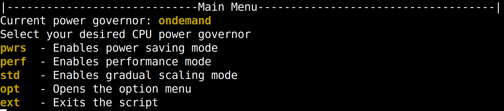
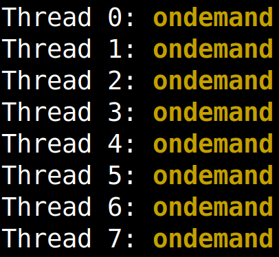

# Laptop-powersave-scripts
This is a script made to improve battery life on linux laptops.  
It allows to switch between cpu power usage modes in the bash terminal.

# Usage
Execute the script with superuser privileges (it's required to unlock more power governors and for switching between cpu usage modes)  
Type the name of the mode you wish to choose and hit enter.  
In the options menu you can switch to an extended mode that shows even more cpu power usage modes.  

Basic modes include:    
Performance mode - Sets the CPU clock speeds to max, regardless of the load  
Power saving mode - Sets the CPU clock speeds to minimum, regardless of the load  
Gradual scaling (ondemand) - Sets the CPU clock speeds depending on the load.  

You can also input your desired mode as a parameter when executing the script to bypass the GUI entirely.    

# Required packages
Cpufreq-utils
    

